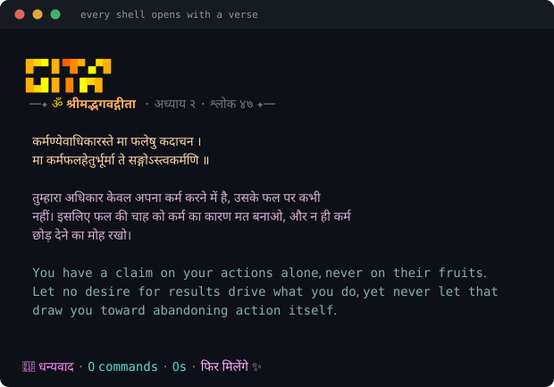
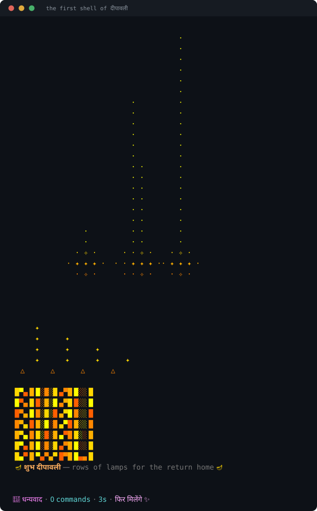
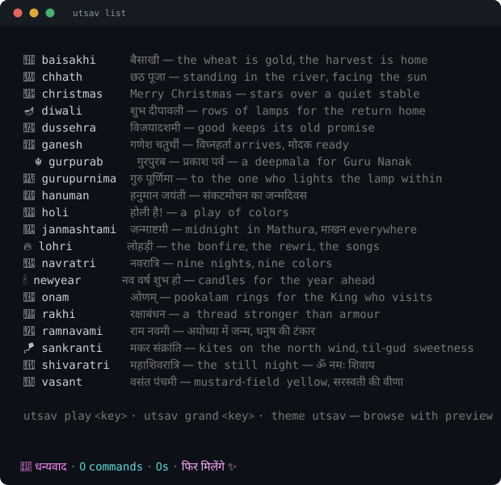
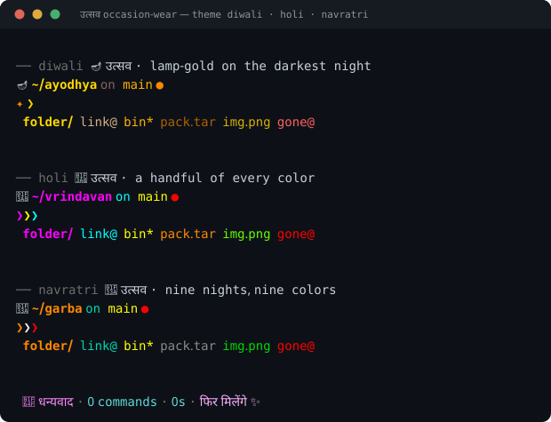
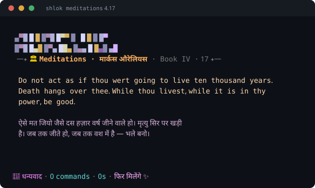

# playful-zsh 🌈

Tiny, playful, **dependency-free** zsh prompt themes. No Oh-My-Zsh, no Powerlevel,
no plugins, no Nerd Fonts — just small zsh scripts you can read in a minute.

You get a two-line prompt with git status, a command timer and a right-side
clock — and then the parts that make it *playful*: every shell opens with a
श्लोक (a verse from the Gita, Ramcharitmanas, Hanuman Chalisa… or Marcus
Aurelius), the real moon lives in your prompt, and on festival days the
terminal quietly celebrates with you.



## Install

One command, anywhere:

```sh
git clone https://github.com/indulge/playful-zsh.git ~/.prompt && ~/.prompt/install.sh
```

The installer adds one managed block to your `~/.zshrc` (idempotent — safe to
re-run). Restart the shell, or `source ~/.zshrc`. To start on a particular
theme: `~/.prompt/install.sh peacock`.

Works out of the box on macOS (zsh is the default shell), Linux, and WSL2 —
in iTerm2, Terminal.app, tmux, or any 256-color terminal. Nothing is compiled,
so x86 and ARM are the same bytes.

## Everyday use — one command: `theme`

```sh
theme                   # 🎨 full-screen picker: browse with live preview
theme peacock           # switch now, remembered next time
theme list              # every theme, current one marked
theme gallery           # preview them all in color
theme random            # surprise me
theme glow on           # ✨ embolden the prompt & file colors
```

The bare `theme` panel re-chromes itself as you browse — the prompt sample,
git segment, and file palette all render in the highlighted theme's colors.
`⏎` applies, `q` keeps yours, `g`/`p` toggle glow and full paths, and **`f`
opens the उत्सव browser** (below). Tab-completion knows every name.

Themes color more than the prompt: `ls`, `tree`, `fd` and tab-completion
listings follow along, because each theme ships a matching `LS_COLORS` palette.

## उत्सव — the terminal celebrates the calendar

`festivals.txt` carries **verified dates for 20 festivals through 2030**
(Drik Panchang, New Delhi convention — Diwali, Holi, Navratri, Onam, Chhath,
Gurpurab, Baisakhi, Eid-free by design, and more). On a festival day:

- **Every shell** greets you with that festival's banner.
- **The first shell of the day** gets the full animated moment — fireworks on
  Diwali, gulal on Holi, a slow sunrise on Chhath. Once per day across all
  your shells and tmux panes, never again until next year. **Any key skips it
  instantly.**
- **While you work**, rarely (twenty-plus minutes and many commands apart), a
  tiny self-erasing spark or moon-glow appears — and vanishes without leaving
  a line in your scrollback.



Any other day, the moments are yours to summon:

```sh
theme utsav             # browse every festival, ⏎ plays its moment
theme utsav holi        # play one directly
utsav list              # the whole roster
Alt-J                   # replay today's (or the last) moment, mid-typing
```



### Occasion-wear themes

Three festivals are also **full themes** — palette, prompt, file colors — that
you can wear any day of the year: `theme diwali` (lamp-gold on the darkest
night), `theme holi` (a handful of every color), `theme navratri` (the arrows
wear each of the nine nights' colors in turn). Switching to one **on its own
festival day** also plays the moment — the day makes the moment; you make the
palette.



## श्लोक — verses, offline, any time

Every new shell opens with a verse card in Devanagari with Hindi and English
meanings — or a Stoic thought with a Hindi rendering. All text lives in plain
files under `quotes/`; nothing ever touches the network.

```sh
shlok                   # a random verse (never the same one twice in a row)
shlok daily             # today's verse — same all day, changes at midnight
shlok gita 2.47         # a specific verse
gita · ramayan · sundarkand · chalisa      # shortcuts per collection
shlok meditations 4.17  # Marcus Aurelius, George Long's translation
shlok list              # browse everything
```

**Alt-G** shows a fresh verse right above whatever you're typing.



Add your own collection: drop a `quotes/mycollection.txt` in the same
`@title/@icon/@ramp/@art` + `[id]/t:/v:/hi:/en:` format and it joins the
rotation automatically.

## Little joys (all offline)

- 🌔 **The real moon lives in your prompt.** Phase from pure date arithmetic;
  the banner names the पक्ष — and on the true full moon, every verse card
  rises in **moonlight silver**.
- 📿 **Japa-mala:** every 108th command earns `एक माला पूर्ण`; each *54th* —
  the half-माला — whispers one dim verse line into your work.
- 🪶 **Karma-phala consolation:** when a command runs ≥10s and *fails*, one dim
  Gita line — the effort was yours; the fruit was never yours to hold. When a
  ≥30s command finally *succeeds*: 🕊️ a धैर्य line, its quiet twin.
- 🍃 **Empathy** for exit codes that mean something: a typo (`127`), a Ctrl-C
  (`130`), a script you forgot to `chmod +x` (`126`) — one kind line, once
  per kind per session, never a lecture.
- 🪷 **Welcome back:** the first command after 30 idle minutes earns a
  half-verse — cross-shell aware, so six tmux panes greet you once, not six
  times.
- 🌱 **साधना:** the shell remembers your lifetime commands. The banner greets
  you by earned title (जिज्ञासु → शिष्य → साधक → योगी → ऋषि — the next level
  is always years away), and the farewell knows your total. `delights` shows
  where you stand.
- 🛤️ **cd-greetings:** entering a repo untouched for a week gets one honest
  line — "last commit here: 19 days ago."
- 🗣️ **One voice.** However many of these want to speak after a command, at
  most **one line** appears above your prompt — the rarest wins, the rest are
  dropped. A prompt renders after every command; it has no right to chatter.
- ●·● **Feather of fortune** (peacock theme): the last 8 exit codes as tiny
  dots, visible only when something recently failed.
- 🙏 **Farewell:** leaving the shell prints धन्यवाद with your session stats.

## Themes

| name        | vibe |
|-------------|------|
| `peacock`   | 🦚 the flagship — royal blue, emerald & gold; coral only for failure |
| `candy`     | 🍭 bubblegum pinks & mint |
| `bubblegum` | 🫧 soft pastel candy floss |
| `synthwave` | 🌆 80s neon magenta & cyan |
| `galaxy`    | 🌌 cosmic violets & starlight |
| `ocean`     | 🌊 deep blues, teal & aqua |
| `forest`    | 🌲 mossy greens & lime |
| `sunset`    | 🌅 warm orange, coral & dusk |
| `rainbow`   | 🌈 full-spectrum, gradient arrows |
| `matrix`    | 💊 digital rain — phosphor greens, λ prompt |
| `dracula`   | 🧛 the editor classic: purple, pink & cyan |
| `gruvbox`   | 📼 retro groove — warm earth tones |
| `nord`      | 🧊 arctic frost blues & aurora accents |
| `crt`       | 🖥️ amber phosphor terminal, ▮ block cursor |
| `diwali`    | 🪔 उत्सव · lamp-gold on the darkest night |
| `holi`      | 🎨 उत्सव · a handful of every color |
| `navratri`  | 🌺 उत्सव · nine nights, nine colors |

`peacock` also shows: user@host over SSH, active venv/conda 🐍, background
jobs ✦, the moon 🌔, and iridescent ❯❯❯ arrows that shift one hue along the
feather with every command.

## Knobs

Set any of these in `~/.zshrc` *before* the managed block; everything defaults
to on.

| knob | what `=0` does |
|------|----------------|
| `PROMPT_BANNER=0`        | no ASCII-art startup banner |
| `PROMPT_SHLOK=0`         | no verse card at startup |
| `PROMPT_KARMA=0`         | no consolation line on long failures |
| `PROMPT_FAREWELL=0`      | no धन्यवाद on exit |
| `PROMPT_FOLLOW=0`        | shells stop following theme switches made elsewhere |
| `PROMPT_UTSAV=0`         | no festival banners, moments, or ambience |
| `PROMPT_UTSAV_AMBIENT=0` | keep the day's banner, drop the while-you-work sparks |
| `PROMPT_UTSAV_KEY='\eo'` | rebind the replay key (default Alt-J, only if free) |
| `PROMPT_EMPATHY=0`       | no kind lines for 126/127/130 |
| `PROMPT_WHISPER=0`       | no धैर्य / welcome-back / half-माला verse lines |
| `PROMPT_WHISPER_GAP=900` | seconds between whispers (this is the default) |
| `PROMPT_SADHANA=0`       | no lifetime titles or totals |
| `PROMPT_CD_GREET=0`      | no lines when returning to old repos |
| `PROMPT_FULL_PATHS=1`    | show full paths (`%d`) instead of `%~` |

## Make it yours

**A theme** is one small file in `themes/` — a description, an `LS_COLORS`
registration, a preview sample, and an apply function. Copy any existing one;
helpers like `_pr_gitstr`, `_pr_timestr`, `_pr_moonstr` and the gradient
printer `_pr_grad` are documented at the top of `init.zsh`.

**A verse collection** is one text file in `quotes/` (format above).

**A festival** is one registry line in `utsav.zsh` plus its dates in
`festivals.txt`. The dates table is verified through 2030 — refresh it from a
published panchang before then; when it runs out, the feature simply goes
quiet.

## Uninstall

```sh
~/.prompt/uninstall.sh   # removes the block from ~/.zshrc; files stay
```
